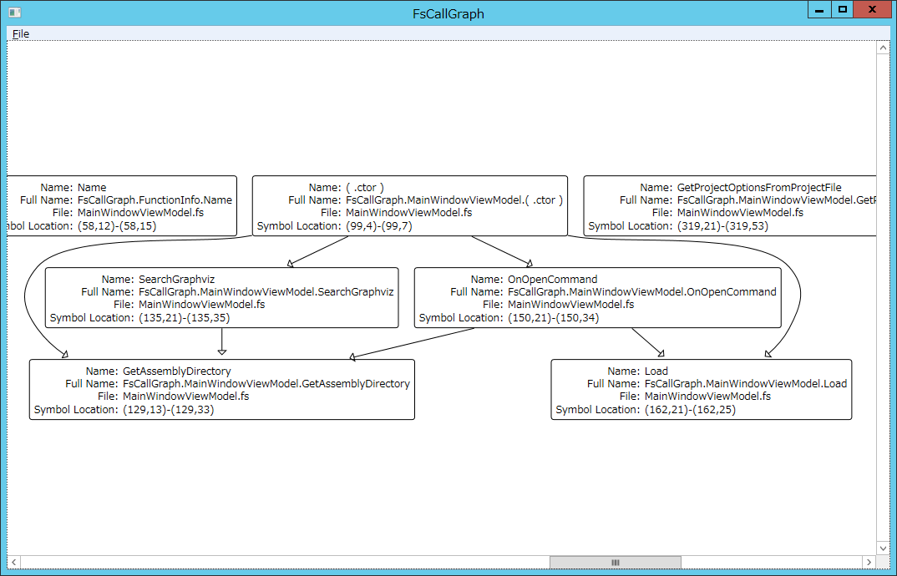

FsCallGraph
===========

**NOTE**

There's no working functions yet.
Simply can load its own fsproj and show callgraph, but might not work for other fsproj.

If you want to try FsCallGraph, you need to put [Graphviz](http://www.graphviz.org/) binary next to FsCallGraph.exe manually.

    FsCallGraph.exe
    graphviz/
      dot.exe
      (snip)

Screenshot
----------

